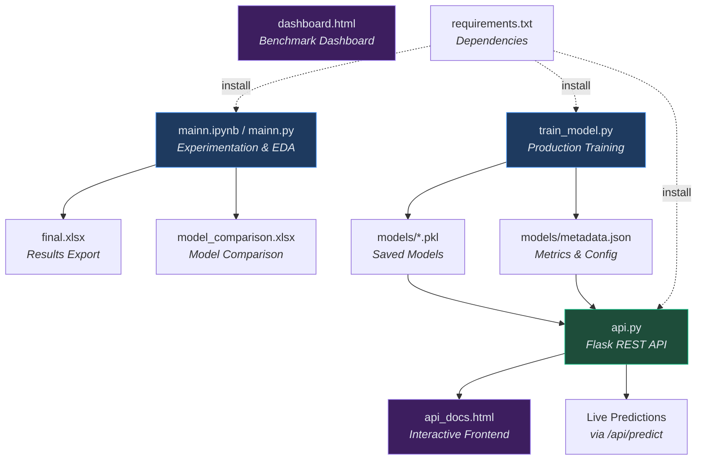

# 📈 Stock Prediction Mini Project — Complete Code Explanation (File-wise)

> This document explains **every single file** in the project, covering its purpose, code walkthrough, and how it connects to the rest of the project.

---

## 📁 Project Structure Overview

```
miniproject/
├── mainn.ipynb              ← Jupyter Notebook (original experimentation)
├── mainn.py                 ← Python script version of the notebook
├── mainn.pyi                ← Python type stub file (initial imports)
├── train_model.py           ← Model training & export pipeline
├── api.py                   ← Flask REST API server
├── api_docs.html            ← Interactive API frontend / documentation page
├── dashboard.html           ← Model comparison benchmark dashboard
├── requirements.txt         ← Python dependencies
├── final.xlsx               ← Exported prediction results
├── model_comparison.xlsx    ← Model accuracy comparison table
├── prob                     ← Empty file (unused)
└── models/
    ├── random_forest.pkl    ← Saved Random Forest model
    ├── decision_tree.pkl    ← Saved Decision Tree model
    ├── logistic_regression.pkl ← Saved Logistic Regression model
    └── metadata.json        ← Model metrics & configuration
```

---

## 1️⃣ `mainn.pyi` — Type Stub / Initial Imports

[mainn.pyi](file:///c:/Users/Nishant/OneDrive/Documents/miniproject/mainn.pyi)

**Purpose:** This is a Python type stub file created at the very start of the project. It only contains basic library imports and was the starting point before the full code was written.

```python
import pandas as pd        # Data manipulation library (DataFrames)
import numpy as np         # Numerical computing (arrays, math)
import yfinance as yf      # Yahoo Finance API to download stock data
```

**Role in project:** This file is not actively used. It was just the first step when setting up the project.

---

## 2️⃣ `mainn.ipynb` — Jupyter Notebook (Original Experimentation)

[mainn.ipynb](file:///c:/Users/Nishant/OneDrive/Documents/miniproject/mainn.ipynb)

**Purpose:** This is the **original development notebook** where the entire ML pipeline was built and tested step-by-step. It's the interactive version used for experimentation.

### Cell 1 — Imports
```python
import pandas as pd                          # DataFrames for tabular data
import numpy as np                           # Numerical operations
import yfinance as yf                        # Download stock data from Yahoo Finance

from sklearn.pipeline import Pipeline        # Chain preprocessing + model together
from sklearn.ensemble import RandomForestClassifier  # Main ML model
from sklearn.model_selection import train_test_split  # Split data into train/test

from newsapi import NewsApiClient            # Fetch news headlines
from textblob import TextBlob               # Sentiment analysis on text
```
**What it does:** Loads all libraries needed — data handling, ML models, and sentiment analysis.

### Cell 2 — Download Stock Data
```python
stocks = ["TCS.NS", "INFY.NS", "RELIANCE.NS", "HDFCBANK.NS"]
```
- Defines 4 Indian NSE stocks to analyze
- Downloads 3 years of historical data (2022–2025) using `yf.download()`
- Flattens MultiIndex columns that yfinance sometimes returns
- Adds a `Stock` column to identify which stock each row belongs to
- Concatenates all 4 stocks into a single DataFrame

### Cell 3 — Data Info
```python
df.info()
```
- Shows the DataFrame structure: 2956 rows, 7 columns
- Confirms data types: `datetime64`, `float64`, `int64`, `str`

### Cell 4 — Data Cleaning
```python
df.columns = [col[0] if isinstance(col, tuple) else col for col in df.columns]
```
- Resolves any remaining tuple column names from MultiIndex
- Displays cleaned data

### Cell 5 — Column Selection & Type Conversion
```python
df = df[['Date','Open','High','Low','Close','Volume','Stock']]
df['Date'] = pd.to_datetime(df['Date'])
df[['Open','High','Low','Close','Volume']] = df[...].astype('float32')
```
- Keeps only essential columns (OHLCV + Stock)
- Converts Date to datetime format
- Converts price/volume to `float32` for memory efficiency

### Cell 6 — Sort & Drop Nulls
```python
df.sort_values('Date', inplace=True)
df.dropna(inplace=True)
```
- Sorts all data chronologically
- Removes any rows with missing values

### Cell 7 — Feature Engineering
```python
df['MA_5']  = df['Close'].rolling(5).mean()     # 5-day moving average
df['MA_10'] = df['Close'].rolling(10).mean()    # 10-day moving average
df['Lag_1'] = df['Close'].shift(1)              # Yesterday's close price
df['Lag_2'] = df['Close'].shift(2)              # Day-before-yesterday's close
df['Volatility'] = df['Close'].rolling(5).std() # 5-day price volatility
df['Return'] = df['Close'].pct_change()         # Daily return percentage
df['Volume_MA'] = df['Volume'].rolling(5).mean()# 5-day volume average
df['Target'] = (df['Close'].shift(-1) > df['Close']).astype(int)  # Target: 1=UP, 0=DOWN
df['MA_diff'] = df['MA_5'] - df['MA_10']        # Trend direction indicator
df['Price_Change'] = df['Close'] - df['Lag_1']  # Absolute price change
df['Volume_Change'] = df['Volume'].pct_change() # Volume change percentage
```

**What each feature means:**

| Feature | Meaning |
|---------|---------|
| `MA_5` | Average close price over last 5 days (short-term trend) |
| `MA_10` | Average close price over last 10 days (medium-term trend) |
| `Lag_1` | Previous day's closing price |
| `Lag_2` | Closing price from 2 days ago |
| `Volatility` | How much the price fluctuates (rolling std deviation) |
| `Return` | Percentage change from previous day |
| `Volume_MA` | Average trading volume over 5 days |
| `MA_diff` | Difference between short & medium moving averages — positive = uptrend |
| `Price_Change` | Absolute price change from yesterday |
| `Volume_Change` | Percentage change in volume from yesterday |
| `Target` | **Label** — 1 if tomorrow's close > today's close, else 0 |

### Cell 8 — Sentiment Analysis
```python
newsapi = NewsApiClient(api_key='4cb5f1c4b1ba44829d55c3bb4207590c')

def get_sentiment(stock_name):
    articles = newsapi.get_everything(q=stock_name, language='en', page_size=5)
    scores = []
    for article in articles['articles']:
        title = article['title']
        score = TextBlob(title).sentiment.polarity  # -1 to +1
        scores.append(score)
    return sum(scores) / len(scores) if scores else 0
```
- Uses NewsAPI to fetch 5 recent news articles for each stock
- Uses TextBlob to calculate **sentiment polarity** of each headline (-1 = negative, +1 = positive)
- Averages the sentiment scores

> **Note:** This cell may fail due to API timeout issues (as seen in notebook output).

### Cell 9 — Train/Test Split & Model Training
```python
features = ['MA_5', 'MA_10', 'Lag_1', 'Lag_2', 'Volatility', 'Return', 
            'Volume_MA', 'MA_diff', 'Price_Change', 'Volume_Change']

X_train, X_test, y_train, y_test = train_test_split(X, y, test_size=0.2, random_state=42)

pipeline = Pipeline([
    ('scaler', StandardScaler()),      # Normalize features to mean=0, std=1
    ('classifier', RandomForestClassifier(
        n_estimators=200,              # 200 trees in the forest
        max_depth=15,                  # Max tree depth = 15
        min_samples_split=5,           # Min 5 samples to split a node
        min_samples_leaf=2,            # Min 2 samples at leaf
        max_features='sqrt',           # Use sqrt(n_features) per split
        random_state=42,               # Reproducibility
        n_jobs=-1                      # Use all CPU cores
    ))
])
pipeline.fit(X_train, y_train)
```

**What it does:**
1. Selects 10 features as input (X) and Target as output (y)
2. Splits data 80/20 with random shuffle
3. Creates a pipeline that first scales features then trains Random Forest
4. Reports training accuracy (~98%) and test accuracy (~80%)

### Cell 10 — Predictions & Results
```python
pred = pipeline.predict(X_test)           # Predict UP/DOWN
conf = pipeline.predict_proba(X_test)[:,1] # Probability of UP

results['Signal'] = results.apply(
    lambda row: "BUY" if row['Confidence'] > 0.65
    else ("SELL" if row['Confidence'] < 0.35 else "HOLD"), axis=1)
```
- Generates predictions and confidence scores
- Creates trading signals: BUY (>65% confident UP), SELL (<35% confident UP), HOLD (in between)
- Maps results back to original Stock names and Dates

### Cell 11 — Export to Excel
```python
results_export.to_excel("final.xlsx", index=False)
```
- Exports prediction results to a formatted Excel file with styled headers

### Cell 12 — Model Comparison
```python
tree_model = DecisionTreeClassifier()
log_model = LogisticRegression(max_iter=500)
```
- Trains Decision Tree and Logistic Regression for comparison
- Creates a comparison table and exports to `model_comparison.xlsx`

---

## 3️⃣ `mainn.py` — Python Script Version of the Notebook

[mainn.py](file:///c:/Users/Nishant/OneDrive/Documents/miniproject/mainn.py)

**Purpose:** This is the **exact same code** as `mainn.ipynb` but in a runnable `.py` script format. Each notebook cell is marked with `# %% [Cell N]` comments.

**Key difference from `train_model.py`:** This uses `train_test_split()` (random shuffle) while `train_model.py` uses time-series split (chronological). The random split can leak future data into training, inflating accuracy.

The code is identical to the notebook cells described above — refer to Section 2 for the detailed explanation.

---

## 4️⃣ `train_model.py` — Production Model Training Pipeline

[train_model.py](file:///c:/Users/Nishant/OneDrive/Documents/miniproject/train_model.py)

**Purpose:** This is the **improved, production-ready** training script that properly handles time-series data and saves models for the API.

### Key Improvements Over `mainn.py`:
1. Uses **time-series split** instead of random split (no data leakage)
2. Computes **precision, recall, F1-score** (not just accuracy)
3. Includes a **backtesting** simulation
4. **Saves models** as `.pkl` files for the API

### Code Walkthrough:

#### Configuration
```python
STOCKS = ["TCS.NS", "INFY.NS", "RELIANCE.NS", "HDFCBANK.NS"]
START_DATE = "2022-01-01"
END_DATE = "2025-01-01"
MODEL_DIR = os.path.join(os.path.dirname(__file__), "models")

FEATURES = ['MA_5', 'MA_10', 'Lag_1', 'Lag_2', 'Volatility', 'Return',
            'Volume_MA', 'MA_diff', 'Price_Change', 'Volume_Change']
```

#### `download_data()` — Lines 42–54
- Downloads OHLCV data for all 4 stocks using `yf.download()`
- Flattens MultiIndex columns
- Adds `Stock` column and concatenates into one DataFrame

#### `clean_and_engineer(df)` — Lines 57–91
- Same feature engineering as the notebook (MA, Lag, Volatility, etc.)
- Creates the binary `Target` column
- Drops NaN rows after all engineering

#### `compute_metrics(y_true, y_pred)` — Lines 94–101
```python
return {
    'accuracy':  accuracy_score(y_true, y_pred),
    'precision': precision_score(y_true, y_pred),   # Of predicted UPs, how many were correct
    'recall':    recall_score(y_true, y_pred),       # Of actual UPs, how many did we catch
    'f1_score':  f1_score(y_true, y_pred),           # Harmonic mean of precision & recall
}
```

#### `backtest(pipeline, df, features)` — Lines 104–159
```python
for i in range(len(predictions) - 1):
    if confidence > 0.6:   # BUY when confident
        pnl = ((exit_price - entry) / entry) * 100
    elif confidence < 0.4:  # SELL (short) when confident
        pnl = ((entry - exit_price) / entry) * 100
```
- Simulates real trading on the test data
- Only trades when model confidence > 60% (BUY) or < 40% (SELL)
- Calculates win rate, average return, total return, best/worst trades

#### `train_models(df)` — Lines 162–237

**⚠️ TIME-SERIES SPLIT (Key Difference):**
```python
df = df.sort_values('Date').reset_index(drop=True)
split_idx = int(len(df) * 0.8)
train_df = df.iloc[:split_idx]   # Past data for training
test_df  = df.iloc[split_idx:]   # Future data for testing
```
This ensures the model **never sees future data during training**.

Trains 3 models:

| Model | Type | Key Parameters |
|-------|------|----------------|
| **Random Forest** | Ensemble (200 trees) | `max_depth=15`, `min_samples_split=5` |
| **Decision Tree** | Single tree | `max_depth=10` |
| **Logistic Regression** | Linear model | `max_iter=500` |

Each model uses a `Pipeline` with `StandardScaler` + the classifier.

#### `save_models(results)` — Lines 240–258
```python
joblib.dump(data['pipeline'], model_path)  # Save model to .pkl file
json.dump(metadata, f, indent=2)          # Save metrics to metadata.json
```
- Saves each trained model as a `.pkl` file in the `models/` directory
- Saves all metrics, features list, and stock list to `metadata.json`

---

## 5️⃣ `api.py` — Flask REST API Server

[api.py](file:///c:/Users/Nishant/OneDrive/Documents/miniproject/api.py)

**Purpose:** A full REST API that loads the trained models and serves real-time stock predictions.

### Code Walkthrough:

#### Imports & Config (Lines 18–46)
```python
from flask import Flask, request, jsonify, send_file
from flask_cors import CORS

MODEL_DIR = os.path.join(os.path.dirname(__file__), "models")
DEFAULT_MODEL = "random_forest"
FEATURES = ['MA_5', 'MA_10', 'Lag_1', 'Lag_2', ...]
```

#### `load_models()` — Lines 57–75
```python
with open(meta_path, 'r') as f:
    metadata = json.load(f)           # Load metrics

for name in ['random_forest', 'decision_tree', 'logistic_regression']:
    models[name] = joblib.load(model_path)  # Load .pkl model
```
- Reads `metadata.json` for model metrics
- Loads all 3 saved `.pkl` models into memory

#### `fetch_stock_data(ticker, days=60)` — Lines 80–100
```python
df = yf.download(ticker, start=start_date, end=end_date, progress=False)
```
- Fetches the last 60 days of live stock data from Yahoo Finance
- Needs 60 days to compute rolling features reliably

#### `compute_features(df)` — Lines 103–120
- Same feature engineering as training (MA_5, MA_10, Lag, Volatility, etc.)
- Applied to freshly downloaded live data

#### `generate_signal(confidence)` — Lines 123–130
```python
if confidence > 0.60: return "BUY"
elif confidence < 0.40: return "SELL"
else: return "HOLD"
```

#### `predict_stock(ticker, model_name)` — Lines 144–217
The core prediction pipeline:
1. Validates the model exists
2. Fetches live stock data
3. Computes features
4. Takes the **latest row** for prediction
5. Runs `pipeline.predict()` and `pipeline.predict_proba()`
6. Calculates directional confidence
7. Gets the next trading day (skips weekends)
8. Returns a comprehensive result dictionary

#### API Routes:

| Route | Method | Description |
|-------|--------|-------------|
| `/` | GET | Serves `api_docs.html` (interactive frontend) |
| `/api/health` | GET | Health check — models loaded count, timestamp |
| `/api/models` | GET | Lists all models with full metrics |
| `/api/stocks` | GET | Lists supported stock tickers |
| `/api/features` | GET | Lists all 10 features with descriptions |
| `/api/predict` | POST | Predict for one ticker (`{"ticker": "TCS.NS"}`) |
| `/api/predict/batch` | POST | Predict for up to 10 tickers at once |

#### `find_free_port()` — Lines 436–445
```python
for port in range(5000, 5010):
    with socket.socket() as s:
        s.bind(('0.0.0.0', port))
        return port
```
- Automatically finds a free port (5000–5010) to avoid conflicts

#### Main Block (Lines 448–465)
```python
if load_models():
    port = find_free_port()
    app.run(host="0.0.0.0", port=port, debug=True)
```
- Loads models, finds a free port, and starts the Flask server

---

## 6️⃣ `api_docs.html` — Interactive API Frontend

[api_docs.html](file:///c:/Users/Nishant/OneDrive/Documents/miniproject/api_docs.html)

**Purpose:** A premium, dark-themed **single-page web app** that serves as both API documentation and an interactive prediction interface.

### Structure:

#### CSS Design System (Lines 9–169)
- **Dark theme** with CSS variables (`--bg: #06080d`, `--accent: #6366f1`)
- **Glassmorphism** effects using `backdrop-filter: blur(20px)`
- **Animated background** with floating orbs and grid overlay
- **Responsive design** with media queries for mobile
- Custom color coding: Green for BUY, Red for SELL, Yellow for HOLD

#### HTML Structure:
1. **Navbar** — Shows "StockSense AI" branding with a live "API Online" indicator (animated green dot)
2. **Hero Section** — Title with gradient text
3. **Prediction Panel** — Input for ticker + model selector + "Predict Now" button
4. **Quick Picks** — Pre-set buttons for TCS, INFY, RELIANCE, HDFCBANK
5. **Results Area** — Dynamically rendered prediction cards
6. **Model Cards** — Shows all 3 models with their accuracy bars

#### JavaScript Logic (Lines 283–434):

##### `predict()` function
```javascript
const res = await fetch(API + '/api/predict', {
    method: 'POST',
    headers: { 'Content-Type': 'application/json' },
    body: JSON.stringify({ ticker, model })
});
```
- Sends a POST request to the API with the selected ticker and model
- Shows loading spinner on button
- Renders result card on success, shows error toast on failure

##### `predictAll()` function
- Sends all 4 tickers in a single batch request to `/api/predict/batch`
- Renders multiple result cards

##### `renderResult(d)` function
- Dynamically creates a styled prediction card showing:
  - Ticker name & Signal badge (BUY/SELL/HOLD)
  - UP/DOWN prediction with icon
  - Current price & confidence bar
  - Accuracy, F1 Score, Precision metrics
  - Warning for low-confidence predictions
  - Whether the trade is recommended

##### On Page Load
```javascript
fetch(API + '/api/models').then(...)
```
- Fetches real model accuracies and updates the model cards

---

## 7️⃣ `dashboard.html` — Model Comparison Benchmark Dashboard

[dashboard.html](file:///c:/Users/Nishant/OneDrive/Documents/miniproject/dashboard.html)

**Purpose:** A **benchmark dashboard** that compares your Random Forest model against industry-standard ML models from published research.

### Features:
1. **KPI Row** — 4 key metrics:
   - Your Model Accuracy: 80%
   - Rank: #4 of 9
   - Beat Baseline by: +30pp (vs random guessing)
   - Gap to SOTA: -14pp (vs best published at 94%)

2. **Bar Chart** (Chart.js) — Compares accuracy of 9 models from Baseline to LSTM
3. **Radar Chart** — Compares your RF vs LSTM across 6 dimensions (Accuracy, Speed, Interpretable, Handles Time, Low Overfit, Easy to Build)
4. **Leaderboard Table** — Full ranking with accuracy bars and tier labels

### Models Compared:

| Rank | Model | Accuracy | Tier |
|------|-------|----------|------|
| 1 | Hybrid PLSTM-TAL | 94% | Elite |
| 2 | XGBoost (tuned) | 91% | Elite |
| 3 | LSTM + Sentiment | 88% | Strong |
| 4 | **YOUR Random Forest** | **80%** | **Your Model** |
| 5 | SVM | 78% | Mid-tier |
| 6 | ARIMA + LSTM | 82% | Strong |
| 7 | Logistic Regression | 75% | Mid-tier |
| 8 | Decision Tree | 75% | Mid-tier |
| 9 | Random Walk (naive) | 50% | Baseline |

5. **Line Chart** — Shows accuracy evolution from Baseline → ML → Deep Learning → Hybrid
6. **Insights Panel** — Strengths (beats basic ML, competitive with published RF) and weaknesses (overfitting gap, random split data leakage)

---

## 8️⃣ `requirements.txt` — Python Dependencies

[requirements.txt](file:///c:/Users/Nishant/OneDrive/Documents/miniproject/requirements.txt)

```
flask>=3.0.0              # Web framework for the API
flask-cors>=4.0.0         # Cross-Origin Resource Sharing (allows frontend to call API)
scikit-learn>=1.3.0       # Machine learning library (models, metrics, preprocessing)
pandas>=2.0.0             # Data manipulation (DataFrames)
numpy>=1.24.0             # Numerical computing
yfinance>=0.2.30          # Download stock data from Yahoo Finance
joblib>=1.3.0             # Save/load trained models (.pkl files)
textblob>=0.17.0          # Text sentiment analysis
newsapi-python>=0.2.7     # Fetch news articles for sentiment
openpyxl>=3.1.0           # Read/write Excel files
```

**Usage:** Install all with `pip install -r requirements.txt`

---

## 9️⃣ `models/metadata.json` — Model Configuration & Metrics

[metadata.json](file:///c:/Users/Nishant/OneDrive/Documents/miniproject/models/metadata.json)

```json
{
  "random_forest": {
    "train_accuracy": 0.9813,      // 98.13% on training data
    "test_accuracy": 0.8,          // 80.0% on test data
    "file": "random_forest.pkl"
  },
  "decision_tree": {
    "train_accuracy": 1.0,         // 100% on training (overfitting!)
    "test_accuracy": 0.7525,       // 75.25% on test data
    "file": "decision_tree.pkl"
  },
  "logistic_regression": {
    "train_accuracy": 0.8023,      // 80.23% on training
    "test_accuracy": 0.7847,       // 78.47% on test data
    "file": "logistic_regression.pkl"
  },
  "features": ["MA_5", "MA_10", "Lag_1", "Lag_2", "Volatility", 
               "Return", "Volume_MA", "MA_diff", "Price_Change", "Volume_Change"],
  "stocks": ["TCS.NS", "INFY.NS", "RELIANCE.NS", "HDFCBANK.NS"]
}
```

**Key observations:**
- Decision Tree has 100% train accuracy → **severe overfitting**
- Random Forest has 18pp gap (98% train vs 80% test) → **moderate overfitting**
- Logistic Regression has smallest gap (80% vs 78%) → **most generalized**

---

## 🔟 `models/*.pkl` — Saved Model Files

| File | Size | Description |
|------|------|-------------|
| `random_forest.pkl` | 6.5 MB | Largest — contains 200 decision trees |
| `decision_tree.pkl` | 49 KB | Single tree, compact |
| `logistic_regression.pkl` | 2 KB | Smallest — just weight coefficients |

These are serialized Python objects saved with `joblib.dump()` and loaded with `joblib.load()`. Each `.pkl` contains a full `Pipeline` object (StandardScaler + Classifier).

---

## 1️⃣1️⃣ `final.xlsx` — Prediction Results Export

**Purpose:** Exported prediction results from `mainn.py` / `mainn.ipynb`.

| Column | Description |
|--------|-------------|
| `Date` | Trading date |
| `Stock` | Stock ticker (TCS.NS, INFY.NS, etc.) |
| `Prediction` | 1 = UP, 0 = DOWN |
| `Signal` | BUY / SELL / HOLD |
| `Confidence` | Model confidence (0–1) |
| `Actual` | What actually happened (ground truth) |
| `Correct` | 1 if prediction was correct, 0 if wrong |

Formatted with blue headers and centered text using `openpyxl`.

---

## 1️⃣2️⃣ `model_comparison.xlsx` — Model Accuracy Comparison

**Purpose:** Simple comparison table of 3 models.

| Model | Accuracy |
|-------|----------|
| Decision Tree | ~75% |
| Random Forest | ~80% |
| Logistic Regression | ~78% |

---

## 1️⃣3️⃣ `prob` — Empty File

[prob](file:///c:/Users/Nishant/OneDrive/Documents/miniproject/prob)

**Purpose:** This is an empty file with 0 bytes. It appears to be unused — possibly a leftover from a debug session or an accidentally created file.

---

## 🔄 How All Files Connect Together



### Workflow:
1. **Experiment** in `mainn.ipynb` → exports results to Excel files
2. **Train for production** with `train_model.py` → saves models to `models/`
3. **Serve predictions** with `api.py` → loads models and serves REST API
4. **Interact** via `api_docs.html` → users make predictions through the web UI
5. **Compare** via `dashboard.html` → benchmark your model against the industry

---

## 📦 How to Run the Project

```bash
# Step 1: Install dependencies
pip install -r requirements.txt

# Step 2: Train models (creates models/ directory)
python train_model.py

# Step 3: Start the API server
python api.py

# Step 4: Open browser to http://localhost:5000
# The api_docs.html page loads automatically
```
